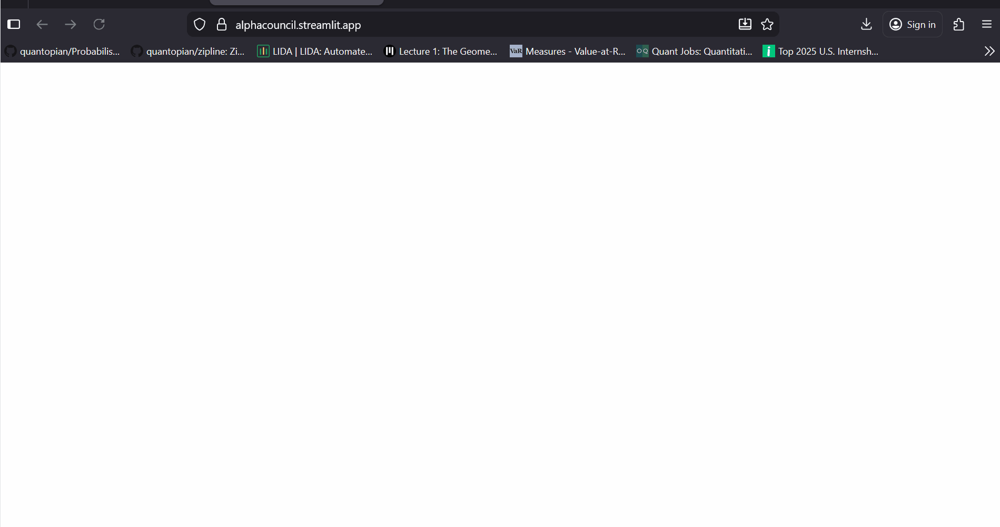

🏛️ AlphaCouncil: Multi-Agent Investment Committee

A synthetic investment committee that simulates institutional decision-making using specialized AI Agents.



💡 The Concept

Investment decisions are rarely black and white. They require synthesizing conflicting viewpoints. AlphaCouncil simulates this dialectic process by instantiating three distinct LLM personas that analyze the same real-time data stream but generate divergent conclusions.

🤖 Agent Architecture

The system utilizes a Waterfall Multi-Agent Flow:

Agent Alpha (The Quant):

Focus: Price Action, RSI, Momentum, Volatility.

Personality: Cold, mathematical, ignores news.

Agent Beta (The Fundamentalist):

Focus: P/E Ratios, Sector Growth, Moats, Earnings.

Personality: Warren Buffett-style value investor.

Agent Gamma (The Risk Officer):

Focus: Downside protection, Beta, Macro correlation.

Personality: Pessimistic, focused on capital preservation.

The Manager (Synthesis Layer):

Aggregates the three reports and issues a final BUY, SELL, or HOLD verdict with a summary thesis.

⚡ Key Features

Real-Time Inference: Connects yfinance data directly to Groq's Llama-3 inference engine for sub-second analysis.

Portfolio Architect: Includes a module for Correlation Matrix analysis and Efficient Frontier visualization.

Structured Prompting: Uses advanced system prompts to enforce distinct agent personas and output formats.

🛠️ Tech Stack

LLM Backend: Groq API (Llama-3-70b-Versatile)

App Framework: Streamlit

Data Processing: Pandas, yFinance

Visualization: Plotly Express

📦 Installation

```
git clone https://github.com/yourusername/AlphaCouncil.git
pip install -r requirements.txt
streamlit run app.py
```
